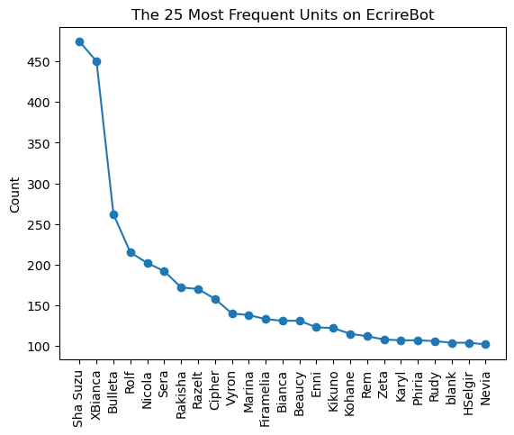
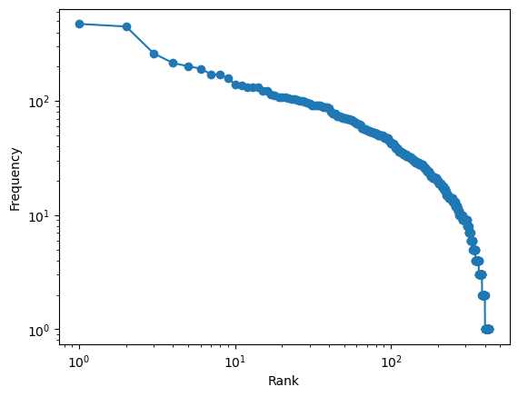
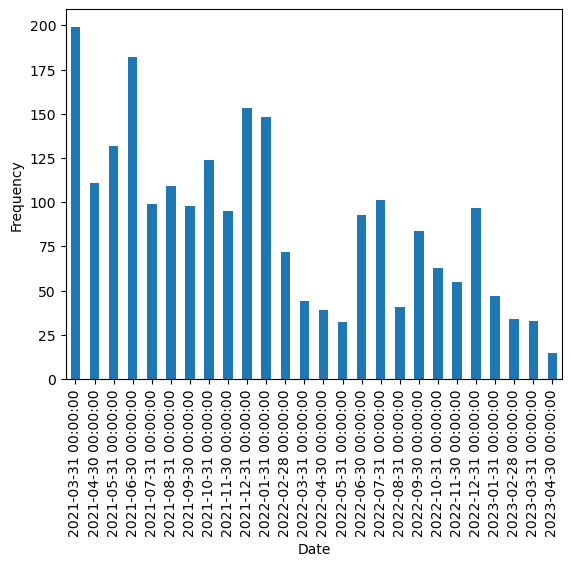
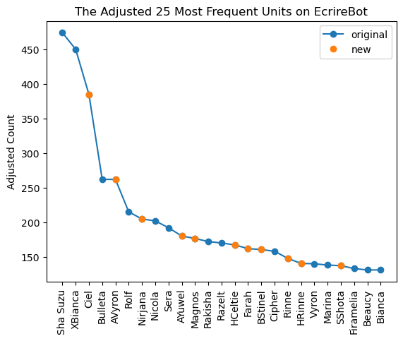
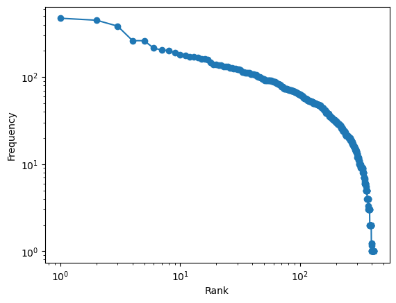
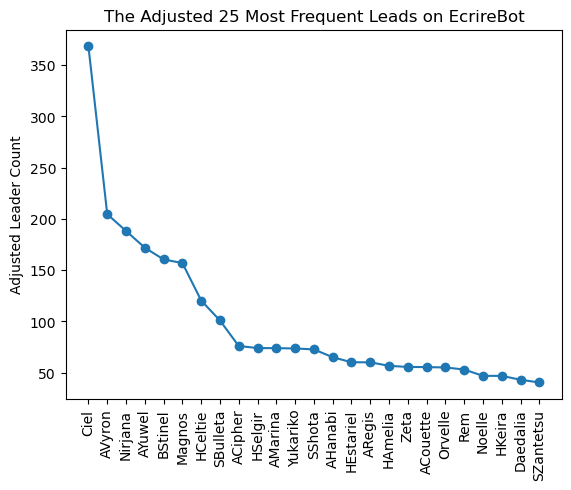
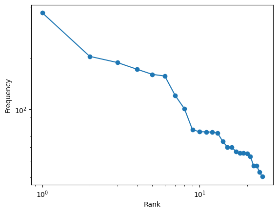

## Overview

EcrireBot is a public database of World Flipper teams, 6-unit configurations consisting of a leader, two main units, and three unison units. We scrape the EcrireBot database and consider whether we might come up with generalizations or realizations about team-building, then discover an interesting connection to Zipf's law.

## Methodology


```python
import re
import requests
import pandas as pd
import numpy as np
import matplotlib.pyplot as plt
from datetime import datetime
from bs4 import BeautifulSoup
```

We start by scraping raw data (team information) from [EcrireBot](ecrire-bot.herokuapp.com/), which is now defunct. The raw data were archived on [GitHub](https://lt900ed.github.io/wf_party_archives/).


```python
partyLinks = []

for i in range(46):
    url = f"https://lt900ed.github.io/wf_party_archives/page/{i+1}.html#searchResult"
    page = requests.get(url)

    # print(page.text)
    soup = BeautifulSoup(page.content, "html.parser")
    partiesList = soup.find(id="resultList")
    parties = partiesList.find_all("a", class_="partyWrap")
    partyLinks = partyLinks + [party["href"] for party in parties]
    
partyCount = len(partyLinks)
```

Next, we clean up and create a dictionary between the English name of a unit or equipment, its Japanese name, and its developer name. *chardata_unclean.csv* and *wepdata.csv* are obtained by processing in-game data files to extract the *developer name* and *English name* for each character and equipment respectively. Manual post-processing was necessary to transliterate names for Japanese characters without a corresponding English release (yet).


```python
charData = pd.read_csv("chardata_unclean.csv")
   
seasonalDictKeys = ['(Holiday)', '(Christmas)', '(Anniversary)', '(Flipperversary)', '(Half Anniversary)', '(Half Flipperversary)',\
                 '(Halloween)', '(Valentine)', '(White Day)', '(Proud)', '(Desert)', '(Summer)', '(New Year)', '(Ballot)', '(Meteor)', '(Ceremony)']
seasonalDictValues = ['X', 'X', 'A', 'A', 'H', 'H', 'H', 'V', 'W', 'P', 'D', 'S', 'NY', 'B', 'M', 'H']
seasonalDict = dict(zip(seasonalDictKeys, seasonalDictValues))
    
for i in range(charData.shape[0]): # clean up names
    text = re.sub(r'\[.*\][\n\s]*', '', charData.iloc[i,0])

    found = re.search(r'\(.*\)', text)
    if found is not None:
        foundText = found.group()
        try:
            text = seasonalDict[foundText] + text
        except KeyError:
            print(f"{foundText} is an invalid key.")
            
    charData.iloc[i,0] = re.sub(r'\s+\(.*\)', '', text)

charDict = dict(zip(pd.concat([charData.iloc[:, 1], charData.iloc[:, 0]]), pd.concat([charData.iloc[:, 0], charData.iloc[:, 1]])))

charData = pd.DataFrame(list(zip(charData.iloc[:, 0], charData.iloc[:, 1])), columns=['EN Name', 'Dev Nicknames'])
charData.to_csv('chardata.csv')

equipData = pd.read_csv("wepdata.csv")
# equipData.iloc[-1, 0] = ''
equipDictJPEN = dict(zip(pd.concat([equipData.iloc[:, 0], equipData.iloc[:, 1]]), pd.concat([equipData.iloc[:, 1], equipData.iloc[:, 0]])))
equipDict = dict(zip(pd.concat([equipData.iloc[:, 1], equipData.iloc[:, 2]]), pd.concat([equipData.iloc[:, 2], equipData.iloc[:, 1]])))
```

Subsequently, we scrape each team page to extract units, equipments, MB2 abilities, and date created. The full processed data is available [here](teamdata.csv).


```python
# team: [unit1, ..., unit6, equip1, ..., equip6, mb2_1, ..., mb2_18, url, time] = 6 + 6 + 18 + 2 = 32 elements
teamArr = [[0] * 32] * partyCount
```


```python
for i in range(partyCount):
    partyLink = partyLinks[i]
    url = f"https://lt900ed.github.io{partyLink}"
    page = requests.get(url)
    soup = BeautifulSoup(page.content, "html.parser")

    dateRaw = soup.find("div", class_="datewrap")
    date = datetime.strptime(dateRaw.text.strip(), "%Y年%m月%d日%H:%M")

    unitsRaw = soup.find(id="abiStatus").find_all("img")
    units = [unitRaw["src"].split('/')[-2] for unitRaw in unitsRaw]
    unitsEN = [charDict[unit] for unit in units]

    mb2Converter = dict(zip(['0', '1', '2', '3', '4', '5', '6'], ['-', '0', '1', '2', '3', '4', '5']))
    mb2sRaw = soup.find_all("div", class_="abiVal")
    mb2sNumeric = [mb2Raw["class"][-1][-1] for mb2Raw in mb2sRaw]
    mb2s = [mb2Converter[num] for num in mb2sNumeric]

    headersRaw = soup.find("table", id="detailTable").find_all("td", class_="col_header")
    equipsRaw = soup.find("table", id="detailTable").find_all("td", class_="col_data")
    equipsJP = ['blank'] * 6
    
    for header, equip in zip(headersRaw, equipsRaw):
        if header.text == 'リーダー装備':
            equipsJP[0] = equip.text
        elif header.text == 'リーダーソウル':
            equipsJP[1] = equip.text
        elif header.text == '2人目武器':
            equipsJP[2] = equip.text
        elif header.text == '2人目ソウル':
            equipsJP[3] = equip.text
        elif header.text == '3人目武器':
            equipsJP[4] = equip.text
        elif header.text == '3人目ソウル':
            equipsJP[5] = equip.text
            
    # print(i, partyLink)
    equipsEN = [equipDictJPEN[equip] for equip in equipsJP]
    equips = [equipDict[equip] for equip in equipsEN]

    teamurl = "https://eliya-bot.herokuapp.com/comp/{}-{}-{}-{}-{}-{}-{}-{}-{}-{}-{}-{}@{}{}{},{}{}{},{}{}{},{}{}{},{}{}{},{}{}{}.png".format(*units, *equips, *mb2s)
    
    teamArr[i] = unitsEN + equipsEN + mb2sNumeric + [teamurl] + [str(date)]
```


```python
teamData = pd.DataFrame(teamArr, columns=['Leader', 'Leader Unison', 'Main 2', 'Unison 2', 'Main 3', 'Unison 3', 'L Weapon', 'L Soul',\
                                         '2 Weapon', '2 Soul', '3 Weapon', '3 Soul', 'L4', 'L5', 'L6', 'LU4', 'LU5', 'LU6', '24', '25',\
                                         '26', '2U4', '2U5', '2U6', '34', '35', '36', '3U4', '3U5', '3U6', 'URL', 'Date'])
teamData.to_csv('teamdata.csv')
```

## Data

Let's have a look at the data...


```python
teamData = pd.read_csv("teamdata.csv").iloc[:, 1:]
teamData
```

<style scoped>
    .dataframe tbody tr th:only-of-type {
        vertical-align: middle;
    }

    .dataframe tbody tr th {
        vertical-align: top;
    }

    .dataframe thead th {
        text-align: right;
    }
</style>
<table border="1" class="dataframe">
  <thead>
    <tr style="text-align: right;">
      <th></th>
      <th>Leader</th>
      <th>Leader Unison</th>
      <th>Main 2</th>
      <th>Unison 2</th>
      <th>Main 3</th>
      <th>Unison 3</th>
      <th>...</th>
      <th>Date</th>
    </tr>
  </thead>
  <tbody>
    <tr>
      <th>0</th>
      <td>Stella</td>
      <td>SYuna</td>
      <td>Special Week</td>
      <td>Teurgis</td>
      <td>blank</td>
      <td>SNephtim</td>
      <td>...</td>
      <td>2023-04-19 20:44:00</td>
    </tr>
    <tr>
      <th>1</th>
      <td>Stella</td>
      <td>Teurgis</td>
      <td>Quinvid</td>
      <td>SYuna</td>
      <td>HNephtim</td>
      <td>XFolus</td>
      <td>...</td>
      <td>2023-04-16 23:02:00</td>
    </tr>
    <tr>
      <th>...</th>
      <td>...</td>
      <td>...</td>
      <td>...</td>
      <td>...</td>
      <td>...</td>
      <td>...</td>
      <td>...</td>
      <td>...</td>
    </tr>
    <tr>
      <th>2298</th>
      <td>Sonia</td>
      <td>Vyron</td>
      <td>Rakisha</td>
      <td>Razelt</td>
      <td>SRazelt</td>
      <td>Bulleta</td>
      <td>...</td>
      <td>2021-03-03 22:36:00</td>
    </tr>
    <tr>
      <th>2299</th>
      <td>ARegis</td>
      <td>Rams</td>
      <td>Beaucy</td>
      <td>Fiora</td>
      <td>Rudy</td>
      <td>Sha Suzu</td>
      <td>...</td>
      <td>2021-03-03 21:15:00</td>
    </tr>
  </tbody>
</table>

It remains to analyze this data. One particular question of interest is whether a certain group of units dominates in terms of usage. The representation of the data can be a little murky here because sometimes a blank spot in a team represents a wildcard slot in which many units can work, but this effect should not be significant enough to affect the unit distribution significantly. Hence, taking a straightforward count of the units present in all teams, we find


```python
leadCount = teamData['Leader'].value_counts()
leadSubCount = teamData['Leader Unison'].value_counts()
main2Count = teamData['Main 2'].value_counts()
sub2Count = teamData['Unison 2'].value_counts()
main3Count = teamData['Main 3'].value_counts()
sub3Count = teamData['Unison 3'].value_counts()
```


```python
countList = [leadCount, leadSubCount, main2Count, sub2Count, main3Count, sub3Count]
totalCount = pd.concat(countList, axis=1).fillna(0).sum(axis=1)
sortedCount = totalCount.sort_values(ascending=False)
```


```python
top25 = sortedCount[:25]
ax = top25.plot(style='-o')
ax.set_xticks(range(25))
ax.set_xticklabels(top25.index.tolist(), rotation=90)
plt.ylabel('Count')
plt.title('The 25 Most Frequent Units on EcrireBot')
plt.show()
```


    

    


Two units, Sha Suzu and XBianca, dominate this count of the 25 most frequent units that appear on EcrireBot teams. These two units are generic support units which can fit into a multitude of team compositions, so their dominance . We also note that the wildcard unit 'blank' has about a hundred occurrences in a data set of 2,300 teams of 6 units (= 13,800 units in all), with a frequency of roughly 0.7%, which is negligible and will not affect the core of our analysis. Interestingly, the distribution seems to loosely follow Zipf's law, as we can confirm on a log-log plot:


```python
plt.loglog(np.arange(len(sortedCount))+1, sortedCount, '-o')
plt.xlabel('Rank')
plt.ylabel('Frequency')
plt.show()
```


    

    


## Analysis

Zipf's law is the empirical observation that, when we tabulate a list of objects (here, units) and their frequency of occurrence in a set of data (here, teams on EcrireBot), then rank them by their frequency of occurrence, we see that $$\text{frequency} \propto \text{rank}^{-\alpha}$$ for $$\alpha \sim 1$$, which corresponds to a linear log-log plot whose slope is $$-\alpha$$. Roughly speaking, we can understand Zipf's law as a result of a [latent variable in the data set](https://www.ncbi.nlm.nih.gov/pmc/articles/PMC5172588/), which broadens the range of frequencies we observe and smooths out the resulting distribution. This broadening and smoothing forms the key to Zipf's law. 

In this case, our latent variable is a measure of a unit's niche.  As far as team-building goes, we frequently want a number of specific units to deal with certain mechanics, and we then fill the remaining team slots with units of generic utility, so teams often consist of units with a range of niches, broad and narrow alike.

The fact that Zipf's law seems to fall apart at high and low ranks suggests that:
- units of generic utility are used even more frequently than would be expected. The most general units are so versatile and so beneficial that they can fit into almost any team.
- units of particularly specific utility (or even no utility at all) are used even less frequently than would be expected. Some units are simply not functional, have such a specific niche that they are never needed, or share a niche with a more common unit and hence go unused.

We do have to be careful about reading too much into the data, because we've also neglected several important factors that we need to take into account. We did not consider the fact that **new units are released on a rolling basis**—newer units are less represented in the data set because they were not available for older teams—and the fact that **the popularity of the site has been waning**—newer units are less represented in the data set because there are fewer new teams being produced than in the past.

We must therefore correct for both these factors. First, we'll look at the rate at which new teams have been added to EcrireBot.


```python
teamData['Date'] = pd.to_datetime(teamData['Date'])
teamDataMonthly = teamData.resample('1M', on='Date').size()
teamDataMonthly.plot.bar()

plt.ylabel('Frequency')
plt.show()
```


    

    


Using this data, we can compute the fraction of teams produced after a certain date.


```python
# sum team counts, but displace by one month for the calculation
teamDataCumMonthly = np.array([0] + list(teamDataMonthly.cumsum())[:-1]) 
teamDataDates = list(map(lambda date: date.strftime("%b %Y"), teamDataMonthly.index.date))
# fraction of eligible teams for a unit from a given date
teamDataFracMonthly = 1-teamDataCumMonthly/np.sum(teamDataMonthly)
teamDataFracMonthly
```


    array([1.        , 0.91347826, 0.86521739, 0.80782609, 0.72869565,
           0.68565217, 0.63826087, 0.59565217, 0.54173913, 0.50043478,
           0.43391304, 0.36956522, 0.33826087, 0.31913043, 0.30217391,
           0.28826087, 0.24782609, 0.20391304, 0.18608696, 0.14956522,
           0.12217391, 0.09826087, 0.05608696, 0.03565217, 0.02086957,
           0.00652174])


This calculation won't be accurate for the last few months' worth of data, because the variance is magnified by the fact that the fraction of eligible teams for the unit is so small, and because units tend to get used in more teams immediately upon release than subsequently. As such, we'll remove all data beyond the 5% threshold—the last three months' worth.


```python
releaseDateToFrac = dict(zip(teamDataDates[:-3], teamDataFracMonthly[:-3]))
```

Next, we have to identify the release date of each unit. This was non-trivial because the information is not easily accessible as data; instead, I had to manually identify the release date based on available banner information in Japanese. 


```python
unitsAndReleaseDates = pd.read_csv("releasedates.csv")
unitsAndReleaseDates['Release Date'] = pd.to_datetime(unitsAndReleaseDates['Release Date'])
releaseDates = list(map(lambda date: date.strftime("%b %Y"), unitsAndReleaseDates['Release Date']))
dateUnitDict = dict(zip(list(unitsAndReleaseDates['Unit']), releaseDates))
```


```python
unitsInData = set(sortedCount.index)
unitsInDateInfo = set(releaseDates['Unit'])
excludedUnits = unitsInData.difference(unitsInDateInfo)
excludedUnits
```


    {'Iorez',
     'King Johnson',
     'MPhiria',
     'MSotieth',
     'Runetta',
     'VBeaucy',
     'VDenah',
     'VFeanie',
     'WLibram',
     'WRolf',
     'Yae',
     'blank'}


These units are the ones that are included in the EcrireBot dataset but for which we do not have release dates listed, which is fine because these are all units that were released within the last three months of operation of EcrireBot, and we have decided to exclude them. 


```python
unitsOfInterest = list(unitsInData.difference(excludedUnits))
appearanceCount = [totalCount[name] for name in unitsOfInterest]
# returns a default multiplier of 1 if the release date of the unit is before the start of EcrireBot 
newnessMultiplier = [1/releaseDateToFrac.get(dateUnitDict[name], 1) for name in unitsOfInterest]
adjustedCount = np.array(appearanceCount)*np.array(newnessMultiplier)

adjustedCountSeries = pd.Series(adjustedCount, index=unitsOfInterest)
sortedAdjustedCountSeries = adjustedCountSeries.sort_values(ascending=False)
```


```python
adjustedTop25 = sortedAdjustedCountSeries[:25]

top25Names = list(top25.index)
adjustedTop25Names = list(adjustedTop25.index)

newUnitMask = [(unit not in top25Names) for unit in adjustedTop25Names]

ax = adjustedTop25.plot(style='-o', label='original')
ax.set_xticks(range(25))
ax.set_xticklabels(list(adjustedTop25.index), rotation=90)
plt.plot(np.arange(25)[newUnitMask], list(adjustedTop25.iloc[newUnitMask]), 'o', label='new')
plt.ylabel('Adjusted Count')
plt.title('The Adjusted 25 Most Frequent Units on EcrireBot')
plt.legend()
plt.show()
```


    

    


Although the shape of the distribution has not changed, the identities of the top 25, adjusted for release date and waning team submissions, are very different. 11 of the adjusted top 25 are relatively new units! I suspect this procedure overcorrects and overemphasizes new units a little, but we're certainly on the right track.  


```python
plt.loglog(np.arange(len(sortedAdjustedCountSeries))+1, sortedAdjustedCountSeries, '-o')
plt.xlabel('Rank')
plt.ylabel('Frequency')
plt.show()
```


    

    


The log-log plot barely looks any different, suggesting that Zipf's law still holds as we would expect, and our original analysis remains qualitatively valid. There, we hypothesized that Zipf's law was valid because of a latent variable in the data set, which we claimed to be a measure of a unit's niche. With our adjusted data, we provide further support for this point by demonstrating that Zipf's law does **not** hold for the rank and frequency of leader units. 

We expect that Zipf's law will not hold because the leader position is particularly restrictive with respect to team composition and cannot readily admit units of generic utility like Sha Suzu or XBianca. The leader position thus requires a specific niche—a specific value of the latent variable, and the "broadening and smoothing" that enables Zipf's law does not apply here. More formally, the leader position conditions on specific values of the latent variable, whereas the team at large admits a spectrum for the latent variable; the latter is necessary for the generic applicability of Zipf's law.


```python
leaderAppearanceCount = [leadCount.get(name, 0) for name in unitsOfInterest]
adjustedLeaderCount = np.array(leaderAppearanceCount)*np.array(newnessMultiplier)

adjustedLeaderCountSeries = pd.Series(adjustedLeaderCount, index=unitsOfInterest)
sortedAdjustedLeaderCountSeries = adjustedLeaderCountSeries.sort_values(ascending=False)

adjustedLeaderTop25 = sortedAdjustedLeaderCountSeries[:25]

ax = adjustedLeaderTop25.plot(style='-o')
ax.set_xticks(range(25))
ax.set_xticklabels(list(adjustedLeaderTop25.index), rotation=90)
plt.ylabel('Adjusted Leader Count')
plt.title('The Adjusted 25 Most Frequent Leads on EcrireBot')
plt.show()
```


    

    


```python
plt.loglog(np.arange(len(adjustedLeaderTop25))+1, adjustedLeaderTop25, '-o')
plt.xlabel('Rank')
plt.ylabel('Frequency')
plt.show()
```


    

    


As expected, Zipf's law does not hold in this latter case!

## Conclusions

We scraped and cleaned team information for 2,300 teams from the EcrireBot site, which we term the EcrireBot data set.

We then demonstrated that the rank-frequency distribution of units in the EcrireBot data set roughly follows Zipf's law and explained this result by the presence of a latent variable in the data set that measures a unit's niche. We argued that Zipf's law holds because good teams generally involve units with a spectrum of niches. We supported this argument by showing that when we restrict the rank-frequency analysis to the leader position only, akin to conditioning on specific niches, Zipf's law no longer holds.

Further, we acknowledged, identified, and corrected our data set for sources of bias, particularly the fact that new units are introduced on a rolling basis and that the rate of team submissions to EcrireBot has significant time dependence.

We've only investigated a subset of the available data, and much more of it remains unexplored. Nevertheless, we will cut off this exploratory analysis here on the grounds that this part of the analysis is most likely to be of intrinsic interest, whereas more detailed analysis, particularly on the identity of the most frequent units, is more specialized and leads to conclusions about World Flipper team-building that have limited generalizability and utility beyond this specific context.
