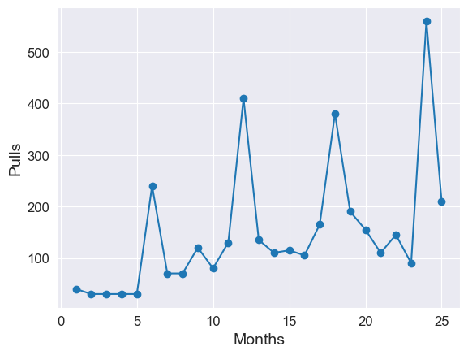
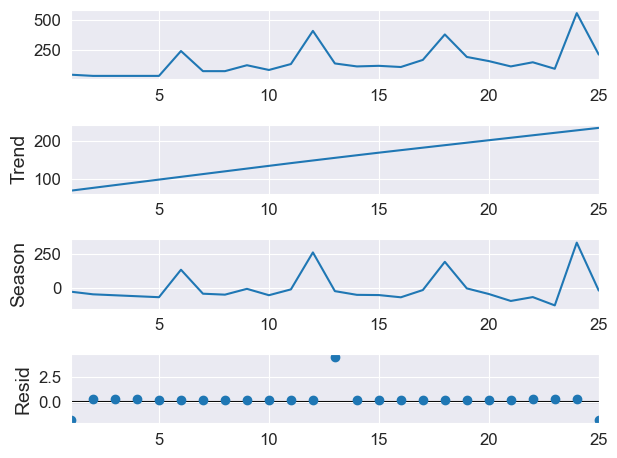
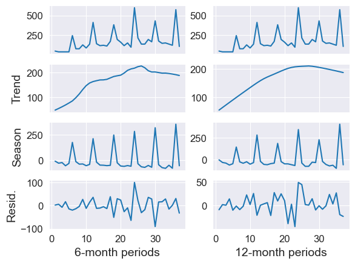
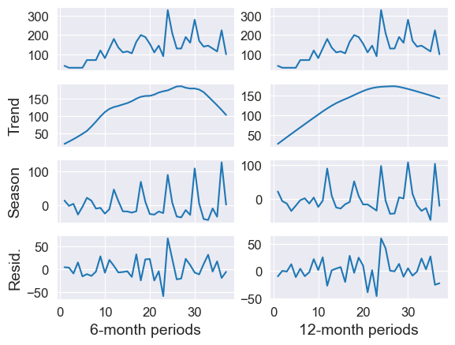
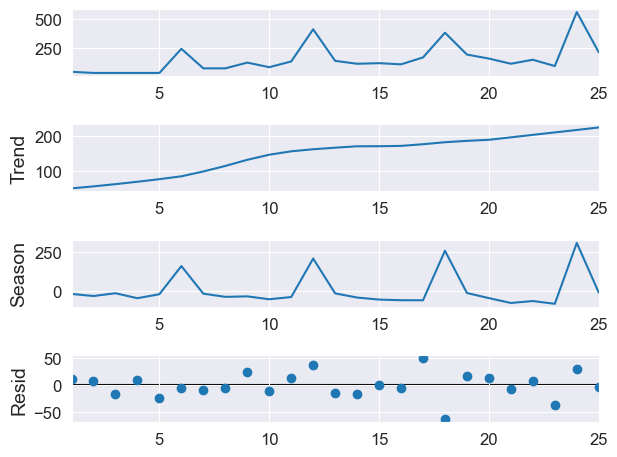
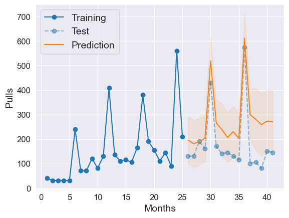
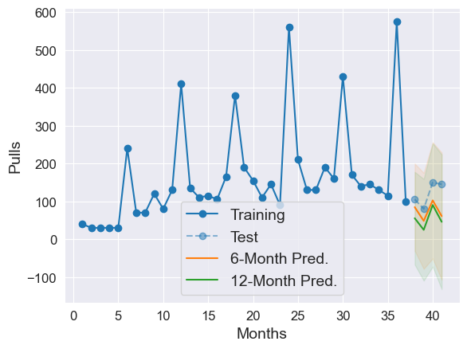

_[Back](index.html) to index._

## Overview

We consider World Flipper's pull income, aggregated over each month, over the course of its two-year history on the global server. Using time series analysis, we forecast the pull income for the third year, then compare the results with the actual third-year pull income on the Japanese server, which is 1.5 years ahead. We then analyze and rationalize the similarities and differences observed between the forecast and actual data.

## Data


```python
import numpy as np
import matplotlib.pyplot as plt
import pandas as pd

import seaborn as sns
from pandas.plotting import register_matplotlib_converters

register_matplotlib_converters()
sns.set_style("darkgrid")

params = {
    'savefig.dpi': 1200,
    'axes.labelsize': 14,
    'axes.titlesize': 14,
    'font.size': 14,
    'xtick.labelsize': 12,
    'ytick.labelsize': 12,
}

plt.rcParams.update(params)
```

```python
rawIncome = [
   #                                                         70,  # Y0
      40,  30,  30,  30,  30, 240,  70,  70, 120,  80, 130, 410,  # Y1
     135, 110, 115, 105, 165, 380, 190, 155, 110, 145,  90, 560,  # Y2
     210]#130, 130, 190, 160, 430, 170, 140, 145, 130, 115, 575   # Y3
   # 100, 105,  80, 150, 145, 350                                 # Y4
    
income = pd.Series(rawIncome, index=np.arange(len(rawIncome))+1)
```

The data for the first six months are estimates, and the monthly cutoff is somewhat inexact. To acknowledge this imprecision, we round all data to the nearest multiple of 5. While we have 3.5 years' worth of data, we exclude the data for the first month on physical considerations (on which more later) and the data for the third year and beyond for comparison with our forecast. In other words, we are using the first two years' worth of data as the training set and the next two years' worth as the test set, but with a physical motivation for the cutoff—it's where the global server is currently at, relative to the Japanese server.

As with the previous project, the data were compiled and tabulated from two sources: [@MiyacoGames](https://twitter.com/MiyacoGames) (Twitter, Japanese) and [a forum post](https://nga.178.com/read.php?tid=24200773&rand=225) (NGA, Chinese).

## Methodology

As usual, we start by looking at the data to identify any patterns.


```python
income.plot(xlabel = "Months", ylabel = "Pulls", style = '-o')
```

    

    


The data exhibit a positive trend (more pulls as time passes) and are clearly seasonal with sharp peaks at 6-month intervals. These peaks correspond to half-anniversary and anniversary events in-game, which give a disproportionate number of pulls relative to the rest of the year. Even so, the anniversary events tend to give more pulls than the half-anniversary events, corresponding to a higher peak on months 12 and 24 compared to months 6 and 18. This suggests that we should take a seasonal period of 12 months rather than 6 months.

### STL Decomposition

To get a better sense of the data, we can perform an STL decomposition.


```python
from statsmodels.tsa.seasonal import STL

incomeRes = STL(income, period = 12, seasonal = 13).fit()
incomeRes.plot()
plt.show()
```


    

    


The residuals and lack of consistent periodicity in the seasonal decomposition suggest that the model is overfitted, likely because two periods' worth of data is insufficient for STL. We can either try to incorporate more data, though this would go against our rationale for the cutoff, or to consider 6-month periods, which are less justified but do produce the 'additional' samples we need. We can study the effect of 6-month versus 12-month periods by considering three years' worth of data before making our decision.


```python
rawIncomeY3 = [
   #                                                         70,  # Y0
      40,  30,  30,  30,  30, 240,  70,  70, 120,  80, 130, 410,  # Y1
     135, 110, 115, 105, 165, 380, 190, 155, 110, 145,  90, 600,  # Y2
     210, 130, 130, 190, 160, 430, 170, 140, 145, 130, 115, 575,  # Y3
     100]#105,  80, 150, 145, 350                                 # Y4
    
incomeY3 = pd.Series(rawIncomeY3, index=np.arange(len(rawIncomeY3))+1)

halfYearIncomeY3 = STL(incomeY3, period = 6, seasonal = 13).fit()
fullYearIncomeY3 = STL(incomeY3, period = 12, seasonal = 13).fit()

def plotSTL(res, axes, xlabel):
    res.observed.plot(ax=axes[0], legend=False)
    res.trend.plot(ax=axes[1], legend=False)
    axes[1].set_ylabel('Trend')
    res.seasonal.plot(ax=axes[2], legend=False)
    axes[2].set_ylabel('Season')
    res.resid.plot(ax=axes[3], legend=False)
    axes[3].set_ylabel('Resid.')
    axes[3].set_xlabel(xlabel)
    
def plotSTLnoY(res, axes, xlabel):
    res.observed.plot(ax=axes[0], legend=False)
    res.trend.plot(ax=axes[1], legend=False)
    res.seasonal.plot(ax=axes[2], legend=False)
    res.resid.plot(ax=axes[3], legend=False)
    axes[3].set_xlabel(xlabel)
    
fig, axes = plt.subplots(ncols=2, nrows=4, sharex=True)

plotSTL(halfYearIncomeY3, axes[:, 0], '6-month periods')
plotSTLnoY(fullYearIncomeY3, axes[:, 1], '12-month periods')

plt.show()
```


    

    


The effect of choosing a 6-month period is more pronounced and noticeably worse than expected. In particular, for the 6-month decomposition, the trend appears to be quite a bit more jagged, and the seasonal effect shows relatively uniform amplification per period rather than the zigzag amplification observed in the more reasonable 12-month decomposition. 

Is there a way we can make the difference less pronounced? We proceed by inspecting the data more carefully. The peaks that arise every six months are simultaneously due to 
- half-anniversary and anniversary events rewarding a lot of pulls, and
- free daily pulls during the event periods to promote player retention and interaction. 

The event period remains relatively unchanged from year to year, though it does differ between the half-anniversary and the anniversary. If we use this information to exclude such daily pulls from our data, we find


```python
rawIncomeY3Rev = [
   #                                                         70,  # Y0
      40,  30,  30,  30,  30, 70,  70,  70, 120,   80, 130, 180,  # Y1
     135, 110, 115, 105, 165, 200, 190, 155, 110, 145,  90, 330,  # Y2
     210, 130, 130, 190, 160, 280, 170, 140, 145, 130, 115, 225,  # Y3
     100]#105,  80, 150, 145, 200                                 # Y4
    
incomeY3Rev = pd.Series(rawIncomeY3Rev, index=np.arange(len(rawIncomeY3Rev))+1)

halfYearIncomeY3Rev = STL(incomeY3Rev, period = 6, seasonal = 13).fit()
fullYearIncomeY3Rev = STL(incomeY3Rev, period = 12, seasonal = 13).fit()

fig, axes = plt.subplots(ncols=2, nrows=4, sharex=True)

plotSTL(halfYearIncomeY3Rev, axes[:, 0], '6-month periods')
plotSTLnoY(fullYearIncomeY3Rev, axes[:, 1], '12-month periods')

plt.show()
```


    

    


This transformation actually seems to make the decomposition worse, since the effect of seasonality is also reduced when we ignore free pulls. In addition, the trend and seasonal components of the 6-month decomposition appear to be respectively decaying too quickly and amplifying too quickly, suggesting that the decomposition is unreliable. The 12-month decomposition is smoother, but the magnitude of the residuals relative to the seasonal component is somewhat concerning.

Considering what we now know, it seems that **the best approach that doesn't use additional data is the 6-month decomposition of the raw data, without correcting for daily pulls**, though we have to be wary of the effect of losing the full 12-month periodicity. Performing an STL decomposition on this approach yields


```python
halfYearIncomeY2 = STL(income, period = 6, seasonal = 13).fit()
halfYearIncomeY2.plot()
plt.show()
```


    

    


### (S)ARIMA

With respect to the forecasting, given the qualitative information obtained by STL decomposition, we will fit our results to a SARIMA model with a 6-month period and variational parameters obtained by minimizing the AIC. 


```python
import pmdarima as pmd

resSARIMA = pmd.auto_arima(rawIncome,
                         start_p=0,  # initial guess for AR(p)
                         start_d=1,  # initial guess for I(d)
                         start_q=0,  # initial guess for MA(q)
                         max_p=2,    # max guess for AR(p)
                         max_d=1,    # max guess for I(d)
                         max_q=2,    # max guess for MA(q)
                         m=6,        # seasonal order
                         start_P=0,  # initial guess for seasonal AR(P)
                         start_D=0,  # initial guess for seasonal I(D)
                         start_Q=0,  # initial guess for seasonal MA(Q)
                         trend='c',
                         information_criterion='aic',
                         trace=True,
                         error_action='ignore'
                         )
```

    Performing stepwise search to minimize aic
     ARIMA(0,0,0)(0,1,0)[6] intercept   : AIC=212.787, Time=0.01 sec
     ARIMA(1,0,0)(1,1,0)[6] intercept   : AIC=212.659, Time=0.06 sec
     ARIMA(0,0,1)(0,1,1)[6] intercept   : AIC=213.753, Time=0.07 sec
     ARIMA(0,0,0)(0,1,0)[6]             : AIC=212.787, Time=0.01 sec
     ARIMA(1,0,0)(0,1,0)[6] intercept   : AIC=214.534, Time=0.03 sec
     ARIMA(1,0,0)(2,1,0)[6] intercept   : AIC=214.652, Time=0.13 sec
     ARIMA(1,0,0)(1,1,1)[6] intercept   : AIC=214.652, Time=0.10 sec
     ARIMA(1,0,0)(0,1,1)[6] intercept   : AIC=213.702, Time=0.09 sec
     ARIMA(1,0,0)(2,1,1)[6] intercept   : AIC=216.652, Time=0.09 sec
     ARIMA(0,0,0)(1,1,0)[6] intercept   : AIC=210.749, Time=0.03 sec
     ARIMA(0,0,0)(2,1,0)[6] intercept   : AIC=212.745, Time=0.09 sec
     ARIMA(0,0,0)(1,1,1)[6] intercept   : AIC=212.745, Time=0.07 sec
     ARIMA(0,0,0)(0,1,1)[6] intercept   : AIC=211.935, Time=0.04 sec
     ARIMA(0,0,0)(2,1,1)[6] intercept   : AIC=214.745, Time=0.07 sec
     ARIMA(0,0,1)(1,1,0)[6] intercept   : AIC=212.686, Time=0.06 sec
     ARIMA(1,0,1)(1,1,0)[6] intercept   : AIC=214.741, Time=0.07 sec
     ARIMA(0,0,0)(1,1,0)[6]             : AIC=210.749, Time=0.03 sec
    
    Best model:  ARIMA(0,0,0)(1,1,0)[6] intercept
    Total fit time: 1.052 seconds
    


```python
resSARIMA.summary()
```

<table class="simpletable">
<caption>SARIMAX Results</caption>
<tr>
  <th>Dep. Variable:</th>            <td>y</td>          <th>  No. Observations:  </th>    <td>25</td>   
</tr>
<tr>
  <th>Model:</th>           <td>SARIMAX(1, 1, 0, 6)</td> <th>  Log Likelihood     </th> <td>-102.374</td>
</tr>
<tr>
  <th>Date:</th>             <td>Wed, 12 Jul 2023</td>   <th>  AIC                </th>  <td>210.749</td>
</tr>
<tr>
  <th>Time:</th>                 <td>16:11:07</td>       <th>  BIC                </th>  <td>213.582</td>
</tr>
<tr>
  <th>Sample:</th>                   <td>0</td>          <th>  HQIC               </th>  <td>211.228</td>
</tr>
<tr>
  <th></th>                        <td> - 25</td>        <th>                     </th>     <td> </td>   
</tr>
<tr>
  <th>Covariance Type:</th>         <td>opg</td>         <th>                     </th>     <td> </td>   
</tr>
</table>
<table class="simpletable">
<tr>
      <td></td>         <th>coef</th>     <th>std err</th>      <th>z</th>      <th>P>|z|</th>  <th>[0.025</th>    <th>0.975]</th>  
</tr>
<tr>
  <th>intercept</th> <td>   67.9191</td> <td>   13.278</td> <td>    5.115</td> <td> 0.000</td> <td>   41.894</td> <td>   93.944</td>
</tr>
<tr>
  <th>ar.S.L6</th>   <td>   -0.6067</td> <td>    0.400</td> <td>   -1.518</td> <td> 0.129</td> <td>   -1.390</td> <td>    0.177</td>
</tr>
<tr>
  <th>sigma2</th>    <td> 2422.0844</td> <td> 1028.211</td> <td>    2.356</td> <td> 0.018</td> <td>  406.828</td> <td> 4437.341</td>
</tr>
</table>
<table class="simpletable">
<tr>
  <th>Ljung-Box (L1) (Q):</th>     <td>0.17</td> <th>  Jarque-Bera (JB):  </th> <td>1.49</td> 
</tr>
<tr>
  <th>Prob(Q):</th>                <td>0.68</td> <th>  Prob(JB):          </th> <td>0.47</td> 
</tr>
<tr>
  <th>Heteroskedasticity (H):</th> <td>2.11</td> <th>  Skew:              </th> <td>-0.37</td>
</tr>
<tr>
  <th>Prob(H) (two-sided):</th>    <td>0.38</td> <th>  Kurtosis:          </th> <td>4.15</td> 
</tr>
</table>Warnings:<br/>[1] Covariance matrix calculated using the outer product of gradients (complex-step).

The SARIMA statistics appear consistent with the assumptions of a (S)ARIMA model. In particular, the Ljung-Box statistic Q is a measure of autocorrelation, and p(Q) > 0.05 means that we cannot reasonably reject the independence of residuals. The independence of residuals is a required assumption for (S)ARIMA, so this is a good check that our variational optimization successfully decorrelated the residuals by differencing. 

Hence carrying out the forecasting, we find


```python
timeWindow = np.arange(1, 42)
allIncome = np.array([
                                                             70,  # Y0
      40,  30,  30,  30,  30, 240,  70,  70, 120,  80, 130, 410,  # Y1
     135, 110, 115, 105, 165, 380, 190, 155, 110, 145,  90, 560,  # Y2
     210, 130, 130, 190, 160, 430, 170, 140, 145, 130, 115, 575,  # Y3
     100, 105,  80, 150, 145, 350])                               # Y4

def plotPrediction(timeWindow, rawData, trainingCutoff, modelResults):
    preds, conf_int = modelResults.predict(n_periods=len(timeWindow[trainingCutoff:]), return_conf_int=True)
    
    plt.plot(timeWindow[:trainingCutoff], rawData[timeWindow[:trainingCutoff]], '-o', color='#1f77b4', label="Training")
    plt.plot(timeWindow[trainingCutoff:], rawData[timeWindow[trainingCutoff:]], '--o', alpha=0.5, color='#1f77b4', label="Test")

    plt.plot(timeWindow[trainingCutoff:], preds, color='#ff7f0e', label="Prediction")
    plt.fill_between(timeWindow[trainingCutoff:],
                     conf_int[:, 0], conf_int[:, 1],
                     alpha=0.1, color='#ff7f0e')

    plt.xlabel("Months")
    plt.ylabel("Pulls")
    plt.legend()

plotPrediction(timeWindow, allIncome, 25, resSARIMA)
```


    

    


## Conclusions

We forecasted the Y3 monthly pull income for World Flipper's global server based on historical data and compared it to the actual Y3 income from the Japanese server. As it turns out, our model was overly optimistic; the monthly pull income saturated in Y3 compared to the increase found in Y1 and Y2. Taking the context of the model into account, a more appropriate interpretation of these results might be that the game developers chose to fix the monthly income relative to what it would have been if it continued growing according to historical data. There are multiple reasons we can propose for this.
- The primary revenue source for gacha games is from pull purchases, and giving away too many free pulls reduces revenue accordingly.
- Pull income arises from events, which generally last a fixed amount of time (1-2 weeks) and do not overlap. At some point, if the schedule is saturated with events, the pull income will also saturate.

## Further Explorations

We now return to the question of 6-month versus 12-month periods. The physical scenario required that we adopt 6-month periods because there were insufficient degrees of freedom to support a 12-month period, but we can certainly continue our exploration with the full dataset now. We keep all data up to Y3 as training and use a SARIMA model to predict Y4 pull income for both 6- and 12-month periods.


```python
halfY3ResSARIMA = pmd.auto_arima(rawIncomeY3,
                         start_p=0,  # initial guess for AR(p)
                         start_d=1,  # initial guess for I(d)
                         start_q=0,  # initial guess for MA(q)
                         max_p=2,    # max guess for AR(p)
                         max_d=1,    # max guess for I(d)
                         max_q=2,    # max guess for MA(q)
                         m=6,        # seasonal order
                         start_P=0,  # initial guess for seasonal AR(P)
                         start_D=0,  # initial guess for seasonal I(D)
                         start_Q=0,  # initial guess for seasonal MA(Q)
                         trend='c',
                         information_criterion='aic',
                         trace=True,
                         error_action='ignore'
                         )
```

    Performing stepwise search to minimize aic
     ARIMA(0,1,0)(0,1,0)[6]             : AIC=370.307, Time=0.01 sec
     ARIMA(1,1,0)(1,1,0)[6]             : AIC=343.197, Time=0.08 sec
     ARIMA(0,1,1)(0,1,1)[6]             : AIC=inf, Time=0.05 sec
     ARIMA(1,1,0)(0,1,0)[6]             : AIC=363.011, Time=0.02 sec
     ARIMA(1,1,0)(2,1,0)[6]             : AIC=344.795, Time=0.17 sec
     ARIMA(1,1,0)(1,1,1)[6]             : AIC=344.576, Time=0.20 sec
     ARIMA(1,1,0)(0,1,1)[6]             : AIC=352.381, Time=0.06 sec
     ARIMA(1,1,0)(2,1,1)[6]             : AIC=inf, Time=0.21 sec
     ARIMA(0,1,0)(1,1,0)[6]             : AIC=350.699, Time=0.04 sec
     ARIMA(2,1,0)(1,1,0)[6]             : AIC=343.228, Time=0.08 sec
     ARIMA(1,1,1)(1,1,0)[6]             : AIC=inf, Time=0.07 sec
     ARIMA(0,1,1)(1,1,0)[6]             : AIC=inf, Time=0.08 sec
     ARIMA(2,1,1)(1,1,0)[6]             : AIC=inf, Time=0.17 sec
     ARIMA(1,1,0)(1,1,0)[6] intercept   : AIC=343.197, Time=0.08 sec
    
    Best model:  ARIMA(1,1,0)(1,1,0)[6]          
    Total fit time: 1.344 seconds
    


```python
fullY3ResSARIMA = pmd.auto_arima(rawIncomeY3,
                         start_p=0,  # initial guess for AR(p)
                         start_d=1,  # initial guess for I(d)
                         start_q=0,  # initial guess for MA(q)
                         max_p=2,    # max guess for AR(p)
                         max_d=1,    # max guess for I(d)
                         max_q=2,    # max guess for MA(q)
                         m=12,        # seasonal order
                         start_P=0,  # initial guess for seasonal AR(P)
                         start_D=0,  # initial guess for seasonal I(D)
                         start_Q=0,  # initial guess for seasonal MA(Q)
                         trend='c',
                         information_criterion='aic',
                         trace=True,
                         error_action='ignore'
                         )
```

    Performing stepwise search to minimize aic
     ARIMA(0,1,0)(0,1,0)[12]             : AIC=279.521, Time=0.01 sec
     ARIMA(1,1,0)(1,1,0)[12]             : AIC=273.473, Time=0.07 sec
     ARIMA(0,1,1)(0,1,1)[12]             : AIC=inf, Time=0.12 sec
     ARIMA(1,1,0)(0,1,0)[12]             : AIC=272.906, Time=0.03 sec
     ARIMA(1,1,0)(0,1,1)[12]             : AIC=273.386, Time=0.09 sec
     ARIMA(1,1,0)(1,1,1)[12]             : AIC=inf, Time=0.27 sec
     ARIMA(2,1,0)(0,1,0)[12]             : AIC=274.233, Time=0.04 sec
     ARIMA(1,1,1)(0,1,0)[12]             : AIC=inf, Time=0.04 sec
     ARIMA(0,1,1)(0,1,0)[12]             : AIC=inf, Time=0.06 sec
     ARIMA(2,1,1)(0,1,0)[12]             : AIC=inf, Time=0.13 sec
     ARIMA(1,1,0)(0,1,0)[12] intercept   : AIC=272.906, Time=0.02 sec
    
    Best model:  ARIMA(1,1,0)(0,1,0)[12] intercept
    Total fit time: 0.906 seconds
    

Interestingly, the models already differ in terms of the seasonal autoregressive parameter $$P$$, with $$P = 1$$ incorporating memory effects in the 12-month fit and $$P = 0$$ incorporating no such dependence in the 6-month fit.


```python
def plotPredictionComparison(timeWindow, rawData, trainingCutoff, modelResults1, modelResults2, label1, label2):
    preds1, conf_int1 = modelResults1.predict(n_periods=len(timeWindow[trainingCutoff:]), return_conf_int=True)
    preds2, conf_int2 = modelResults2.predict(n_periods=len(timeWindow[trainingCutoff:]), return_conf_int=True)
    
    plt.plot(timeWindow[:trainingCutoff], rawData[timeWindow[:trainingCutoff]], '-o', color='#1f77b4', label="Training")
    plt.plot(timeWindow[trainingCutoff:], rawData[timeWindow[trainingCutoff:]], '--o', alpha=0.5, color='#1f77b4', label="Test")

    plt.plot(timeWindow[trainingCutoff:], preds1, color='#ff7f0e', label=label1)
    plt.fill_between(timeWindow[trainingCutoff:], conf_int1[:, 0], conf_int1[:, 1], alpha=0.1, color='#ff7f0e')
    
    plt.plot(timeWindow[trainingCutoff:], preds2, color='#2ca02c', label=label2)
    plt.fill_between(timeWindow[trainingCutoff:], conf_int2[:, 0], conf_int2[:, 1], alpha=0.1, color='#2ca02c')

    plt.xlabel("Months")
    plt.ylabel("Pulls")
    plt.legend()

plotPredictionComparison(timeWindow, allIncome, 37, halfY3ResSARIMA, fullY3ResSARIMA, "6-Month Pred.", "12-Month Pred.")
```


    

    


It turns out that the 6-month forecast actually performs slightly better in this scenario! This is likely due to the variational SARIMA parameters chosen. The 12-month forecast has memory dependence and is unduly affected by the remarkable discrepancy between the data at month 36 and month 37, while the 6-month forecast has no such issue. That said, the confidence intervals are large enough that both forecasts are safely within error of each other, so we cannot truly make a distinction one way or another. The fact that both predictions are similar gives us some confidence that our original analysis, conducted with a 6-month rather than a 12-month forecast, is nonetheless representative of the actual system at large.

_[Back](index.html) to index._