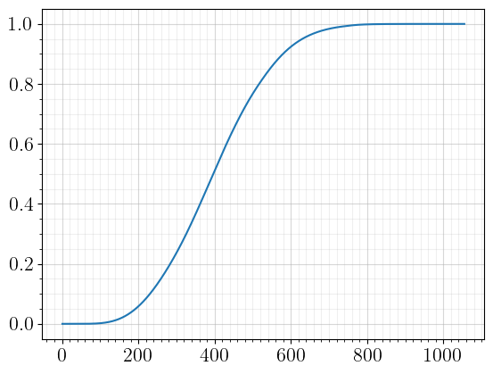
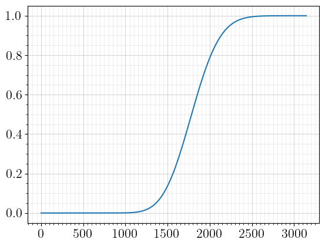

_[Back](index.html) to index._

## Overview

In this analysis, we evaluate the cumulative distribution function of pulls required to obtain a certain selection of units over an annual schedule of rate-up banners, then cross-reference it with the annual income to identify a reasonable selection of targeted units for that year. 

## Background

Before we jump in, we review background information about World Flipper that contextualizes this analysis. In World Flipper, units are added to the unit pool by means of rate-up banners, for which the probability for getting new (rate-up) units is enhanced.

Because there is insufficient game income for collecting all units, it is necessary to pick and choose certain units to prioritize. On the other hand, saving up too much may cause you to lose out on otherwise interesting or valuable units, so having a good estimate for the number of pulls required for all units of interest is invaluable.  Relevant income and banner data were obtained from the Japanese version of the game, which provides about 1.5 years' worth of foreknowledge.

The following table reports the chance of obtaining a rate-up unit of a given rarity (3/4/5★) given the number of rate-up units of that rarity. 

| Rate-ups |   1   |   2   |   3   |   4   |
| :------: | :---: | :---: | :---: | :---: |
| 3★ | 3.5% | - | - | - |
| 4★ | 2.5% | 2.0% | 1.7% | - |
| 5★ | 1.5% | 1.0% | 0.7% | 0.5% |

In addition, there are a number of additional considerations:
- Every pull, there is a 5% total probability for obtaining a 5★ unit, 25% for a 4★ unit, and 70% for a 3★ unit.
- If performing 10 pulls at a time, the tenth pull instead has a 5% total probability for obtaining a 5★ unit and 95% for a 4★ unit. 4★ rate-up rates are scaled accordingly.
- Upon reaching 250 pulls on a banner, any rate-up unit may be obtained for free as a bonus. 
- Players may choose to stop upon obtaining an indeterminate subset of rate-up units, which is cheaper than going a specific subset. 

These factors significantly increase the difficulty of computing the associated probability distributions, but it turns out we can still perform the calculations analytically by casework.

## Methodology

We begin with the standard package declarations and figure formatting.

```python
import numpy as np
import matplotlib as mpl
import matplotlib.pyplot as plt
import matplotlib.ticker as ticker

params = {
    'text.latex.preamble': ['\\usepackage{gensymb}'],
    'image.origin': 'lower',
    'image.interpolation': 'nearest',
    'image.cmap': 'gray',
    'axes.grid': False,
    'savefig.dpi': 1200,
    'axes.labelsize': 24,
    'axes.titlesize': 24,
    'font.size': 24,
    'legend.fontsize': 16,
    'xtick.labelsize': 16,
    'ytick.labelsize': 16,
    'mathtext.fontset': 'stix',
    'text.usetex': True
}

mpl.rcParams.update(params)
```

We are interested in probabilities like $$P(A \cap B; n)$$, the probability of pulling units A and B at least once each within $$n$$ pulls.

Casework allows us to decompose these probabilities into linear combinations of their complements $$P(A'; n)$$, $$P(A' \cap B'; n)$$, and so on. The crucial insight is realizing that these complements are straightforward to calculate because they are independent and hence multiplicative with respect to $$n$$: for instance, we have $$P(A' \cap B'; n) = (1 - p_A - p_B)^n$$, where $$p_A := P(A; n = 1)$$ is the probability of getting unit A in a single pull and similarly for $$p_B$$.  


```python
def df1(pA:'float', n:'int'=250) -> 'list':
    # df = 'degrees of freedom'; df1 = 1 unit of interest
    # see df2() for inputs/outputs
    m = np.arange(251)
    
    pAc = (1-pA)**m
    
    def neg0(): # p(A)
        return 1 - pAc
    def neg1(): # p(A')
        return pAc
    
    cdf = (neg0() + neg1()*(m>=250))[:n+1]
    
    return cdf
    

def df2(pA:'float', pB:'float', arbit:'int'=2, n:'int'=500) -> 'list':
    # inputs
    # pA, pB: the probability of pulling unit A, B in a single pull
    # arbit: how many unique units you want if you don't care which specific
    # units you get; e.g., if you want any 1 of the 2 rate-ups, 'arbit' = 1
    # n: number of pulls to do (defaults to maximum needed to get all units
    #   accounting for spark)

    # output = [pdf, cdf]
    # pdf: the probability density for getting both units in [1, ..., n] pulls
    # cdf: the cumulative distribution function for getting both units in 
    #   [0, 1, ..., n] pulls
    
    m = np.arange(501)
    
    pAc, pBc = (1-pA)**m, (1-pB)**m
    pABc = (1-pA-pB)**m
    
    def neg0(): # p(AB) = p(A and B) 
        return 1 - pAc - pBc + pABc
    def neg1(): # p(AB') + p(A'B) = p(A and not B) + p(not A and B)
        return pBc - pABc + pAc - pABc
    def neg2(): # p(A'B') = p(not A and not B)
        return pABc
    
    if arbit == 2:
        cdf = (neg0() + neg1()*(m>=250) + neg2()*(m>=500))[:n+1] 
        # spark means that we can miss one more unit every 250 pulls,
        #   so we incorporate parts of a distribution in a piecewise fashion
        #   beyond 250 pulls, we can add in neg1(), the distribution for
        #   pulling all but one unit; beyond 500, we can add in neg2()
    elif arbit == 1:
        cdf = (neg0() + neg1() + neg2()*(m>=250))[:n+1]
    
    return cdf
    
def df3(pA:'float', pB:'float', pC:'float', arbit:'int'=3, fix:'int'=0, n:'int'=750) -> 'list':
    # inputs
    # fix: how many among the 'arbit' units to specify; e.g., if you want
    #   either AB or AC, then 'arbit' = 2 and 'fix' = 1.
    #   only makes sense if 'arbit' is specified and 0 < 'fix' < 'arbit'
    #   'fix' fixes units from left to right; if 'fix' = 1, then A is 
    #   mandatory. if 'fix' = 2, then A and B are mandatory.
    
    m = np.arange(751)
    
    pAc, pBc, pCc = (1-pA)**m, (1-pB)**m, (1-pC)**m
    pABc, pACc, pBCc = (1-pA-pB)**m, (1-pA-pC)**m, (1-pB-pC)**m
    pABCc = (1-pA-pB-pC)**m
    
    def neg0(): # p(ABC) 
        return 1 - pAc-pBc-pCc + pABc+pACc+pBCc - pABCc
    def neg1(): # p(ABC') + p(AB'C) + p(A'BC)
        return (pCc - pACc - pBCc + pABCc
              + pBc - pABc - pBCc + pABCc
              + pAc - pABc - pACc + pABCc)
    def neg1A(): # p(ABC') + p(AB'C)
        return (pCc - pACc - pBCc + pABCc
              + pBc - pABc - pBCc + pABCc)
    def neg2(): # p(AB'C') + p(A'BC') + p(A'B'C)
        return pBCc-pABCc + pACc-pABCc + pABc-pABCc
    def neg3(): # p(A'B'C')
        return pABCc
    
    if arbit == 3:
        cdf = (neg0() + neg1()*(m>=250) + neg2()*(m>=500) + neg3()*(m>=750))[:n+1]
    elif arbit == 2 and fix == 1:
        cdf = (neg0() + neg1A() + neg2()*(m>=250) + neg3()*(m>=500))[:n+1]
    elif arbit == 2:
        cdf = (neg0() + neg1() + neg2()*(m>=250) + neg3()*(m>=500))[:n+1]
    elif arbit == 1:
        cdf = (neg0() + neg1() + neg2() + neg3()*(m>=250))[:n+1]
    
    return cdf

def df4(pA:'float', pB:'float', pC:'float', pD:'float', arbit:'int'=4, fix:'int'=0, n:'int'=1000) -> 'list':
    
    m = np.arange(1001)
    
    pAc, pBc, pCc, pDc = (1-pA)**m, (1-pB)**m, (1-pC)**m, (1-pD)**m
    pABc, pACc, pADc, pBCc, pBDc, pCDc = (1-pA-pB)**m, (1-pA-pC)**m, (1-pA-pD)**m, (1-pB-pC)**m, (1-pB-pD)**m, (1-pC-pD)**m
    pABCc, pABDc, pACDc, pBCDc = (1-pA-pB-pC)**m, (1-pA-pB-pD)**m, (1-pA-pC-pD)**m, (1-pB-pC-pD)**m
    pABCDc = (1-pA-pB-pC-pD)**m
    
    def neg0(): # p(ABCD) 
        return 1 - pAc-pBc-pCc-pDc + pABc+pACc+pADc+pBCc+pBDc+pCDc - pABCc-pABDc-pACDc-pBCDc + pABCDc
    def neg1(): # p(ABCD') + p(ABC'D) + p(AB'CD) + p(A'BCD)
        return (pDc - pADc-pBDc-pCDc + pABDc+pACDc+pBCDc - pABCDc
              + pCc - pACc-pBCc-pCDc + pABCc+pACDc+pBCDc - pABCDc
              + pBc - pABc-pBCc-pBDc + pABCc+pABDc+pBCDc - pABCDc
              + pAc - pABc-pACc-pADc + pABCc+pABDc+pACDc - pABCDc)
    def neg1A(): # p(ABCD') + p(ABC'D) + p(AB'CD)
        return (pDc - pADc-pBDc-pCDc + pABDc+pACDc+pBCDc - pABCDc
              + pCc - pACc-pBCc-pCDc + pABCc+pACDc+pBCDc - pABCDc
              + pBc - pABc-pBCc-pBDc + pABCc+pABDc+pBCDc - pABCDc)
    def neg1AB(): # p(ABCD') + p(ABC'D)
        return (pDc - pADc-pBDc-pCDc + pABDc+pACDc+pBCDc - pABCDc
              + pCc - pACc-pBCc-pCDc + pABCc+pACDc+pBCDc - pABCDc)
    def neg2(): # p(ABC'D') + p(AB'CD') + p(AB'C'D) + p(A'BCD') + p(A'BC'D) + p(A'B'CD)
        return (pCDc - pACDc-pBCDc + pABCDc
              + pBDc - pABDc-pBCDc + pABCDc
              + pBCc - pABCc-pBCDc + pABCDc
              + pADc - pABDc-pACDc + pABCDc
              + pACc - pABCc-pACDc + pABCDc
              + pABc - pABCc-pABDc + pABCDc)
    def neg2A(): # p(ABC'D') + p(AB'CD') + p(AB'C'D)
        return (pCDc - pACDc-pBCDc + pABCDc
              + pBDc - pABDc-pBCDc + pABCDc
              + pBCc - pABCc-pBCDc + pABCDc)
    def neg2AB(): # p(ABC'D') + p(AB'CD') + p(AB'C'D) + p(A'BCD') + p(A'BC'D)
        return (pCDc - pACDc-pBCDc + pABCDc
              + pBDc - pABDc-pBCDc + pABCDc
              + pBCc - pABCc-pBCDc + pABCDc
              + pADc - pABDc-pACDc + pABCDc
              + pACc - pABCc-pACDc + pABCDc)
    def neg3(): # p(AB'C'D') + p(A'BC'D') + p(A'B'CD') + p(A'B'C'D)
        return pBCDc-pABCDc + pACDc-pABCDc + pABDc-pABCDc + pABCc-pABCDc
    
    def neg4(): #p(A'B'C'D')
        return pABCDc
    
    if arbit == 4:
        cdf = (neg0() + neg1()*(m>=250) + neg2()*(m>=500) + neg3()*(m>=750) + neg4()*(m>=1000))[:n+1]
    elif arbit == 3 and fix == 2:
        cdf = (neg0() + neg1AB() + neg2AB()*(m>=250) + neg3()*(m>=500) + neg4()*(m>=750))[:n+1]
    elif arbit == 3 and fix == 1:
        cdf = (neg0() + neg1A() + neg2()*(m>=250) + neg3()*(m>=500) + neg4()*(m>=750))[:n+1]
    elif arbit == 3:
        cdf = (neg0() + neg1() + neg2()*(m>=250) + neg3()*(m>=500) + neg4()*(m>=750))[:n+1]
    elif arbit == 2 and fix == 1:
        cdf = (neg0() + neg1A() + neg2A() + neg3()*(m>=250) + neg4()*(m>=500))[:n+1]
    elif arbit == 2:
        cdf = (neg0() + neg1() + neg2() + neg3()*(m>=250) + neg4()*(m>=500))[:n+1]
    elif arbit == 1:
        cdf = (neg0() + neg1() + neg2() + neg3() + neg4()*(m>=250))[:n+1]
    
    return cdf
```
We have therefore identified the cdfs for banners with up to 4 rate-up units, including cases in which we care only about the number or identity of the units.

The casework gets very tedious by the time we get to banners with 4 rate-up units. Nevertheless, when working with such small numbers, explicit enumeration is viable and least prone to careless errors, especially since the terms can be grouped together and there is cohesive structure.

Subsequently, we define helper functions for statistical analysis and for convolving an array of distributions together. Convolution is relevant here because the distribution of a sum of random variables is the convolution of the individual distributions.

```python
def convol(cdfs):
    pdfs = [cdf[1:] - cdf[:-1] for cdf in cdfs]
    for index, pdf in enumerate(pdfs):
        if index == 0: 
            convpdf = pdf
            continue        
        convpdf = np.convolve(convpdf, pdf)
    convcdf = np.concatenate([[0]*(len(cdfs)-1), np.cumsum(convpdf)])
    
    return convpdf, convcdf

def dfstatistics(pdf):
    mean = np.sum(np.arange(len(pdf))*pdf)
    vari = np.sum(np.arange(len(pdf))**2*pdf) - mean**2
    stdev = np.sqrt(vari)
    
    return mean, stdev
```

Then, we use these functions to obtain analytical distributions for a set of planned pulls.

```python
# normalized solo rate-up 4* probability: 0.032237
# normalized duo rate-up 4* probability: 0.025749
```

We account for the boosted 4★ rate from 10-pulls by calculating the corresponding normalized per-pull 4★ rate $$p$$ by setting the probability of not obtaining the 4★ within a 10-pull equal in both scenarios. For a solo rate-up 4★, which normally has a 2.5% probability, we evaluate $$(1-0.025)^9(1-0.095) = (1-p)^{10}$$ to find $$p = 0.032237$$, and repeat the process for a duo rate-up 4★.

Finally, we populate the respective distribution functions and convolve them to obtain the final distribution of pulls over a specified time period (here, up to the second anniversary of the game).

```python
cdf9 = df2(0.025749, 0.01) # rinne + mishima yuki
cdf10 = df2(0.01, 0.01) # amarina + acouette
cdf11 = df2(0.01, 0.01) # acipher + ashiro
cdf12 = df1(0.032237) # xfolus

cdfs = [cdf9, cdf10, cdf11, cdf12]

pdf, cdf = convol(cdfs)
cutoff = np.argmax(cdf >= 1-1E-6) # mask to hide extremely rare events

fig, ax = plt.subplots(1,1)
plt.plot(np.arange(cutoff)+1,cdf[:cutoff])
ax.xaxis.set_minor_locator(ticker.AutoMinorLocator(10))
ax.yaxis.set_minor_locator(ticker.AutoMinorLocator(4))

plt.grid()
ax.grid(which='minor', alpha=0.2)
ax.grid(which='major', alpha=0.5)
plt.show()

print('success = rinne + yuki + amarina + acouette + acipher + ashiro + xfolus')
print('')
for i in [0.8, 0.9, 0.95, 0.99]:
    print('{}% chance of success: {} pulls.'.format(int(100*i), np.argmax(cdf >= i)))
print('')
print('pred. income: 90 (nov) + 230 (free) + 300 (dec) = 620 pulls')
```


    

    


    success = rinne + yuki + amarina + acouette + acipher + ashiro + xfolus
    
    80% chance of success: 516 pulls.
    90% chance of success: 579 pulls.
    95% chance of success: 629 pulls.
    99% chance of success: 727 pulls.
    
    pred. income: 90 (nov) + 230 (free) + 300 (dec) = 620 pulls
    

As our foreknowledge permits, we can even go further and analyze all relevant banners up to the third anniversary...

```python
cdf1 = df3(0.007, 0.007, 0.007) # nyorv + (nyberc) + (toraetty)
cdf2 = df1(0.01) # wschult
cdf3 = df2(0.007, 0.007) # atoria + (adia)
cdf4 = df1(0.02) # silence suzuka/special week
cdf5 = df1(0.014) # darkness/aqua
cdf6 = df2(0.01, 0.01) # sshouta + sparfait
# cdf7 = df1(0.007) # sbulleta
# cdf7 = df3(0.007, 0.007) # sbulleta + sprim
cdf7 = df3(0.007, 0.007, 0.007) # sbulleta + (sprim) + (szan)
cdf8 = df3(0.032237, 0.01, 0.01) # luca + farah + laputina
cdf9 = df2(0.01, 0.01) # magnos + yukariko
cdf11 = df3(0.032237, 0.01, 0.01) # hkeira + hceltie + hrinne
cdf12 = df1(0.01) # asta
cdf13 = df3(0.032237, 0.01, 0.01, arbit=2, fix=1) # fuuran + elmore/zephyr
cdf14 = df4(0.005, 0.005, 0.005, 0.005) # ayuwel + avyron + ciel + nirjana
cdf15 = df2(0.032237, 0.01) # xhartlief + xkikuno

cdfs = [cdf1, cdf2, cdf3, cdf5, cdf6, cdf7, cdf8, cdf9, cdf11, cdf12, cdf13, cdf14, cdf15]

pdf, cdf = convol(cdfs)
cutoff = np.argmax(cdf >= 1-1E-6)

fig, ax = plt.subplots(1,1)
plt.plot(np.arange(cutoff)+1,cdf[:cutoff])
ax.xaxis.set_minor_locator(ticker.AutoMinorLocator(10))
ax.yaxis.set_minor_locator(ticker.AutoMinorLocator(4))

plt.grid()
ax.grid(which='minor', alpha=0.2)
ax.grid(which='major', alpha=0.5)
plt.show()

print('success = nyorv + (nyberc) + (toraetty) + wschult + atoria + (adia)') 
print('         + silence suzuka/special week + darkness/aqua + sshouta')
print('         + sparfait + sbulleta + (sprim) + (szan) + farah + luca')
print('         + (laputina) + magnos + (yukariko) + hkeira + hceltie')
print('         + asta + fuuran + elmore/zephyr + ayuwel + avyron')
print('         + ciel + nirjana + xhartlief + xkikuno')
print('')
for i in [0.8, 0.9, 0.95, 0.99]:
    print('{}% chance of success: {} pulls.'.format(int(100*i), np.argmax(cdf >= i)))
```


    

    


    success = nyorv + (nyberc) + (toraetty) + wschult + atoria + (adia) 
                + silence suzuka/special week + darkness/aqua + sshouta
                + sparfait + sbulleta + (sprim) + (szan) + farah + luca
                + (laputina) + magnos + (yukariko) + hkeira + hceltie 
                + asta + fuuran + elmore/zephyr + ayuwel + avyron
                + ciel + nirjana + xhartlief + xkikuno
    
    80% chance of success: 2012 pulls.
    90% chance of success: 2135 pulls.
    95% chance of success: 2237 pulls.
    99% chance of success: 2431 pulls.
    

The estimated income for the third year of gameplay is 2,490 pulls, so we will happily be able to obtain this roster of units with >99% certainty. In other words, we will need roughly three standard deviations' worth of bad luck to miss out on any of these units.

### A statistical sidenote

From a comparison of the cumulative distribution functions for the second and third years, we observe that their limiting behavior approaches that of the error function. This is a realization of the central limit theorem: the distribution of pulls across $$N$$ independent banners becomes Gaussian in the limit of large $$N$$, and its cumulative distribution function is hence the error function.

## Appendix

Estimated income was compiled and tabulated from two sources: [@MiyacoGames](https://twitter.com/MiyacoGames) (Twitter, Japanese) and [a forum post](https://nga.178.com/read.php?tid=24200773&rand=225) (NGA, Chinese).

_[Back](index.html) to index._